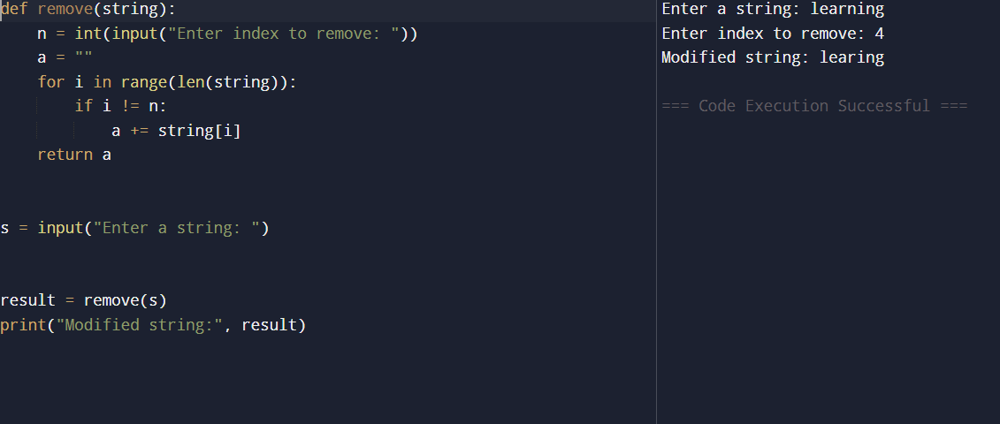

# Module-3
# 🧹 Strings-Remove Nth Index Character from a String

## 🎯 Aim
To write a Python program that accepts a string and removes the character at a specified index.

## 🧠 Algorithm
1. Define a function named `remove` that takes the input string as an argument.
2. Read the index `n` from the user input.
3. Initialize an empty string `a` to store the new string.
4. Iterate over each index of the string using a `for` loop.
5. Check if the current index `i` is not equal to `n`.
6. If `i != n`, append the character at index `i` to string `a`.
7. After the loop, return the modified string `a`.
8. Print the final result.

## 💻 Program
```
def remove(string):
    n = int(input("Enter index to remove: "))
    a = ""
    for i in range(len(string)):
        if i != n:
            a += string[i]
    return a


s = input("Enter a string: ")


result = remove(s)
print("Modified string:", result)

```
## Output


## Result
